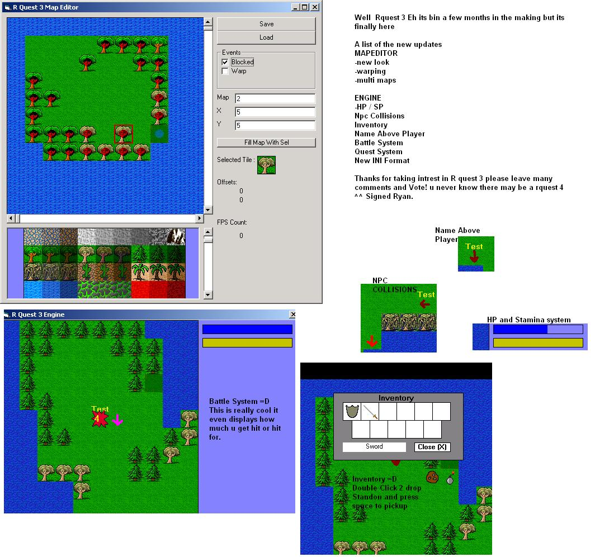



## A \! R Quest 3 \( RPG \) \!

### Description

R quest 3 is a small Rpg made by Ryan as the R would stand for ^^ the Code behind this game is fairly simple and even if your not an intermediate programer i think you would still be able 2 understand it and make a game OFF this project.

PS PLEASE IF YOU READ THAT TEXT OR THIS TEXT YOU MUST COMMENT / VOTE That is my Term's of conditions I REALLY wANT FEEDBACK! as you prolly have guessed by the fact i made it 1 of my terms and conditions.
 
### More Info
 

             |
---                |---
**Submitted On**   |2005-03-04 23:24:14
**By**             |[Ryan L \(rm200ie\)](https://github.com/Planet-Source-Code/PSCIndex/blob/master/ByAuthor/ryan-l-rm200ie.md)
**Level**          |Intermediate
**User Rating**    |4.3 (17 globes from 4 users)
**Compatibility**  |VB 6\.0
**Category**       |[Games](https://github.com/Planet-Source-Code/PSCIndex/blob/master/ByCategory/games__1-38.md)
**World**          |[Visual Basic](https://github.com/Planet-Source-Code/PSCIndex/blob/master/ByWorld/visual-basic.md)
**Archive File**   |[A\_\!\_R\_Ques189720652005\.zip](https://github.com/Planet-Source-Code/ryan-l-rm200ie-a-r-quest-3-rpg__1-60920/archive/master.zip)

